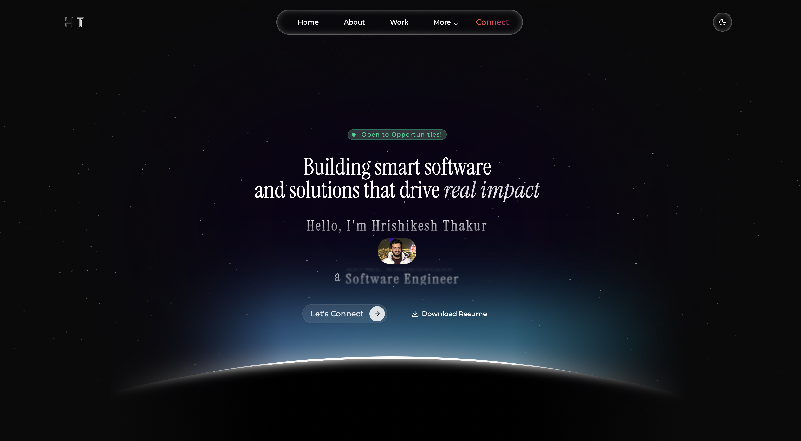
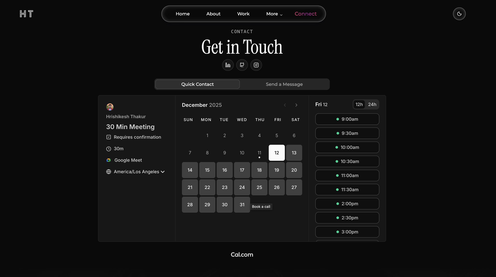
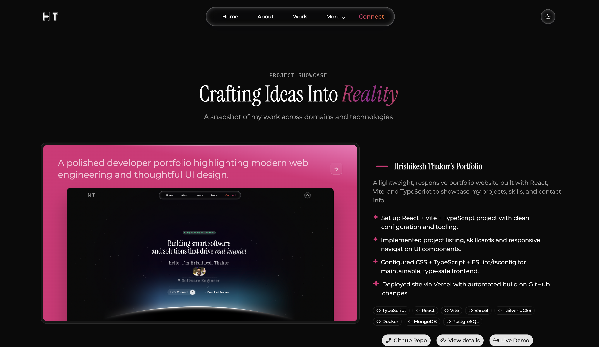
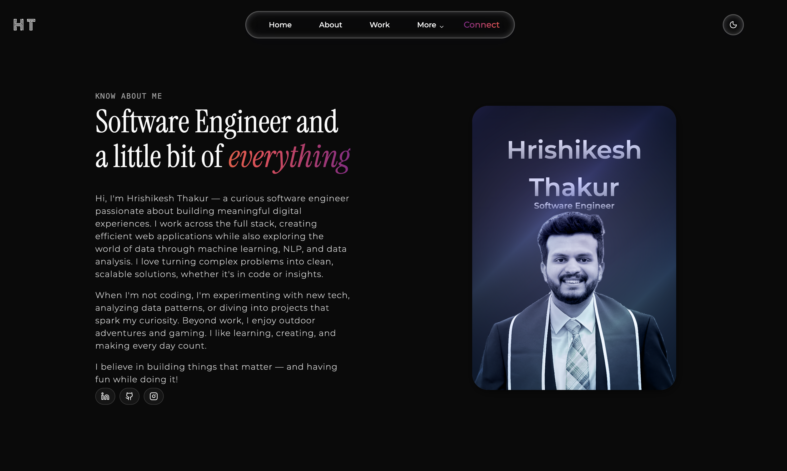

# Hrishikesh Thakur | Portfolio

[](https://hrishikeshthakur.com/)

## 📖 Project Summary

This project is a modern, responsive personal portfolio website designed to showcase software engineering skills, projects, and professional experience. Built with performance and aesthetics in mind, it features a dynamic user interface with 3D particle effects, smooth animations, and a seamless dark/light mode experience.

The application serves as a central hub for my professional identity, integrating real-time data from GitHub and offering a direct line of communication via a serverless contact form.

## ✨ Features and Capabilities

-   **Interactive 3D Particles**: Immersive background effects using `@tsparticles` and `three.js`.
-   **Responsive Design**: Mobile-first layout optimized for all devices using **Tailwind CSS v4**.
-   **Dark/Light Theme**: robust theme switching capabilities powered by `next-themes`.
-   **Real-time GitHub Stats**: dynamically fetches and displays repository counts and contribution graphs via Vercel Serverless Functions.
-   **Contact Form**: Secure, serverless email integration using **EmailJS** and Vercel Functions.
-   **Animations**: Smooth page transitions and component animations with **Framer Motion**.
-   **Project Showcase**: organized display of projects with filtering and detailed views.

## 📸 Screenshots

<table>
  <tr>
    <td align="center">
      
      <br />
      <sub><b>Figure 1:</b> Home Screen</sub>
    </td>
    <td align="center">
      
      <br />
      <sub><b>Figure 2:</b> Contact Screen</sub>
    </td>
  </tr>
<tr>
    <td align="center">
      
      <br />
      <sub><b>Figure 3:</b>Projects Screen</sub>
    </td>
    <td align="center">
      
      <br />
      <sub><b>Figure 4:</b>About Screen</sub>
    </td>
  </tr>
</table>

## 🛠 Tech Stack

### Frontend
-   **Framework**: [React 19](https://react.dev/)
-   **Build Tool**: [Vite](https://vitejs.dev/)
-   **Language**: [TypeScript](https://www.typescriptlang.org/)
-   **Styling**: [Tailwind CSS v4](https://tailwindcss.com/)
-   **Animations**: [Framer Motion](https://www.framer.com/motion/), [Three.js](https://threejs.org/)
-   **UI Components**: [Radix UI](https://www.radix-ui.com/), [Lucide React](https://lucide.dev/)

### Backend (Serverless)
-   **Runtime**: Node.js (Vercel Serverless Functions)
-   **API Handling**: `@vercel/node`
-   **Integrations**:
    -   **GitHub API** (Data fetching)
    -   **EmailJS** (Contact form submission)

### Tools & DevOps
-   **Linting**: ESLint, Prettier
-   **Deployment**: [Vercel](https://vercel.com/)
-   **Package Manager**: npm

## 🏗 Architecture and Flow

The project is built as a **Single Page Application (SPA)** using React, served via Vite. However, it leverages a hybrid architecture for security and performance:

1.  **Frontend (SPA)**: Handles all UI rendering, routing, and client-side interactions. Static assets are optimized by Vite.
2.  **Serverless Layer (`/api`)**:
    -   **Security**: Sensitive operations like sending emails and fetching GitHub data with private tokens are offloaded to Vercel Serverless Functions.
    -   **Proxying**: The frontend calls these endpoints (`/api/email`, `/api/github`) instead of Third-party APIs directly, keeping API keys hidden from the client browser.

## 📂 File Structure

```plaintext
├── api/                  # Vercel Serverless Functions
│   ├── email.ts          # Handles email dispatch via EmailJS
│   └── github.ts         # Fetches GitHub stats (repos, contributions)
├── src/
│   ├── components/       # Reusable UI components
│   ├── data/             # Static content (projects, experience, skills)
│   ├── hooks/            # Custom React hooks
│   ├── pages/            # Main page views
│   ├── utils/            # Helper functions
│   ├── App.tsx           # Main application entry
│   └── main.tsx          # DOM rendering
├── public/               # Static assets (images, icons)
├── index.html            # Entry HTML file
├── package.json          # Dependencies and scripts,
└── README.md             # Project documentation
```

## 🚀 Installation and Setup

Follow these steps to run the project locally.

### Prerequisites
-   Node.js (v18+ recommended)
-   npm or yarn

### Steps

1.  **Clone the repository**
    ```bash
    git clone https://github.com/hrishikesh2708/portfolio.git
    cd portfolio
    ```

2.  **Install dependencies**
    ```bash
    npm install
    # or
    yarn install
    ```

3.  **Configure Environment Variables**
    Create a `.env` file in the root directory (see [Environment Variables](#-environment-variables) section).

4.  **Start the development server**
    ```bash
    npm run dev
    ```
    The app will be available at `http://localhost:5173`.

## 🔑 Environment Variables

To fully utilize the contacting and GitHub stats features, you need to configure the following variables in a `.env` file for local development, and in your Vercel project settings for production.

| Variable | Description |
| :--- | :--- |
| `EMAILJS_SERVICE_ID` | Your EmailJS Service ID |
| `EMAILJS_TEMPLATE_ID` | Your EmailJS Template ID |
| `EMAILJS_PUBLIC_KEY` | Your EmailJS Public Key |
| `EMAILJS_PRIVATE_KEY` | Your EmailJS Private Key (for server-side signing) |
| `GITHUB_USERNAME` | GitHub username to fetch stats for |
| `GITHUB_TOKEN` | GitHub Personal Access Token (with read:user scope) |

## 📦 Key Modules

-   **`src/data/`**: Centralized logic for content management. Edit files here (e.g., `projects.tsx`, `experience.tsx`) to update portfolio content without touching UI code.
-   **`api/email.ts`**: A secure endpoint that proxies requests to EmailJS. It verifies inputs and safeguards your private keys.
-   **`src/components/ui/`**: Contains atomic design components (buttons, cards, inputs) styled with Tailwind and Radix UI primitives.

## 🚢 Deployment

This project is optimized for deployment on **Vercel**.

1.  Push your code to a GitHub repository.
2.  Import the project into Vercel.
3.  Vercel will automatically detect Vite.
4.  **Crucial**: Add the environment variables listed above in the Vercel Dashboard (Project Settings > Environment Variables).
5.  Deploy!

## 🔮 Future Improvements

-   [ ] Add a blog section using MDX.
-   [ ] Implement unit tests with Vitest.
-   [ ] Add more 3D interactive elements.
-   [ ] Improve accessibility (A11y) score.

## 📄 License

Distributed under the MIT License. See `LICENSE` for more information.

## 🙏 Acknowledgments

-   [React](https://reactjs.org/)
-   [Vite](https://vitejs.dev/)
-   [Tailwind CSS](https://tailwindcss.com/)
-   [Radix UI](https://www.radix-ui.com/)
-   [Framer Motion](https://www.framer.com/motion/)
-   [Aceternity UI](https://ui.aceternity.com/) (for motion primitives inspiration)
